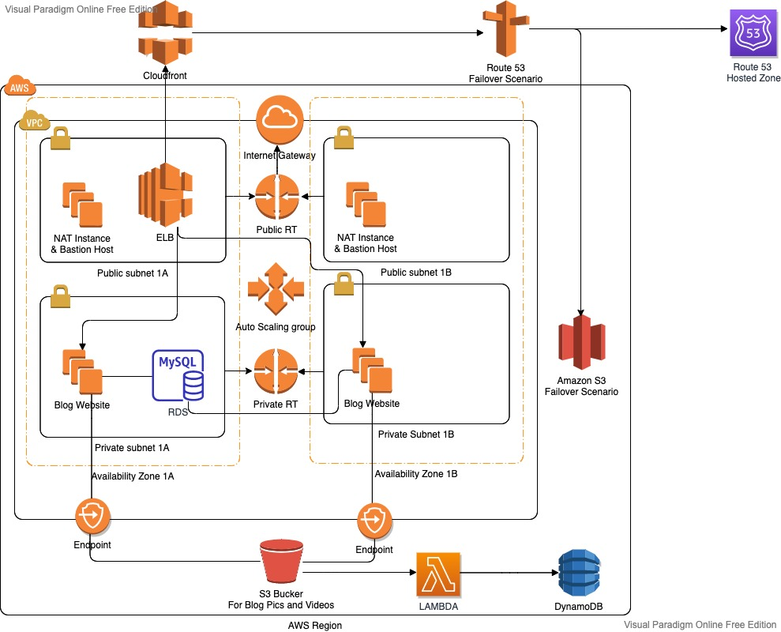

# Blog Page Application (Django) deployed on AWS Application Load Balancer with Auto Scaling, S3, Relational Database Service(RDS), VPC's Components, Lambda, DynamoDB and Cloudfront with Route 53

## Description

- The Blog Page Application aims to deploy blog application as a web application written Django Framework on AWS Cloud Infrastructure.

- This infrastructure has Application Load Balancer with Auto Scaling Group of Elastic Compute Cloud (EC2) Instances and Relational Database Service (RDS) on defined VPC. 

- The Cloudfront and Route 53 services are located in front of the architecture and manage the traffic in secure. User is able to upload pictures and videos on own blog page and these are kept on S3 Bucket. 

- The Cloudfront and Route 53 services are located in front of the architecture and manage the traffic in secure. User is able to upload pictures and videos on own blog page and these are kept on S3 Bucket. The object list of S3 Bucket containing movies and videos is recorded on DynamoDB table. 

## Steps of project
  
- Step 1: Create dedicated VPC and whole components

- Step 2: Create Security Groups (ALB ---> EC2 ---> RDS)

- Step 3: Create RDS

- Step 4: Create two S3 Buckets and set one of these as static website.

- Step 5: Download or clone project definition from `blogpage` repo on Github 

- Step 6: Prepare your Github repository 

- Step 7: Prepare a userdata to be utilized in Launch Template

- Step 8: Write RDS, S3 in settings file given by Fullstack Developer team  

- Step 9: Create NAT Instance in Public Subnet

- Step 10: Create Launch Template and IAM role for it

- Step 11: Create certification for secure connection

- Step 12: Create ALB and Target Group

- Step 13: Create Autoscaling Group with Launch Template

- Step 14: Create Cloudfront in front of ALB

- Step 15: Create Route 53 with Failover settings

- Step 16: Create DynamoDB Table

- Step 17-18: Create Lambda function 

- Step 17-18: Create S3 Event and set it as trigger for Lambda Function
- Bash scripting

- AWS EC2 Launch Template Configuration

- AWS VPC Configuration
  - VPC
  - Private and Public Subnets
  - Private and Public Route Tables
  - Managing routes
  - Subnet Associations
  - Internet Gateway
  - NAT Gateway
  - Bastion Host
  - Endpoint

- AWS EC2 Application Load Balancer Configuration

- AWS EC2 ALB Target Group Configuration

- AWS EC2 ALB Listener Configuration

- AWS EC2 Auto Scaling Group Configuration

- AWS Relational Database Service Configuration

- AWS EC2, RDS, ALB Security Groups Configuration

- IAM Roles configuration

- S3 configuration

- Static website configuration on S3

- DynamoDB Table configuration

- Lambda Function configuration

- Get Certificate with AWS Certification Manager Configuration

- AWS Cloudfront Configuration

- Route 53 Configuration

- Git & Github for Version Control System

## Notes

- RDS database should be located in private subnet. just EC2 machines that has ALB security group can talk with RDS.

- RDS is located on private groups and only EC2s can talk with it on port 3306

- ALB is located public subnet and it redirects traffic from http to https

- EC2's are located in private subnets and only ALB can talk with them

## Resources

- [Python Django Framework](https://www.djangoproject.com/)

- [Python Django Example](https://realpython.com/get-started-with-django-1/)

- [AWS CLI Command Reference](https://docs.aws.amazon.com/cli/latest/index.html)
