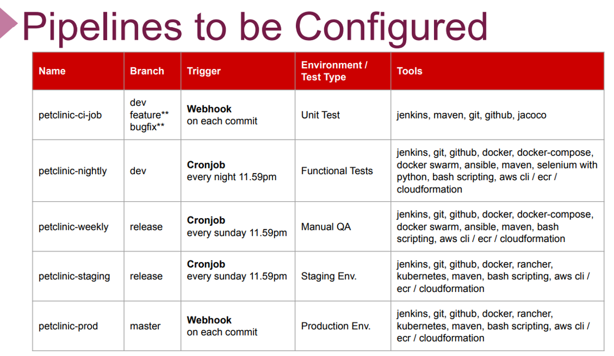
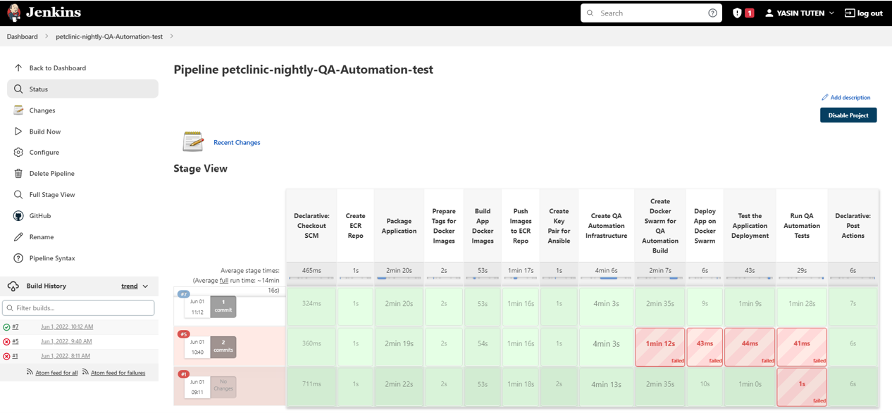
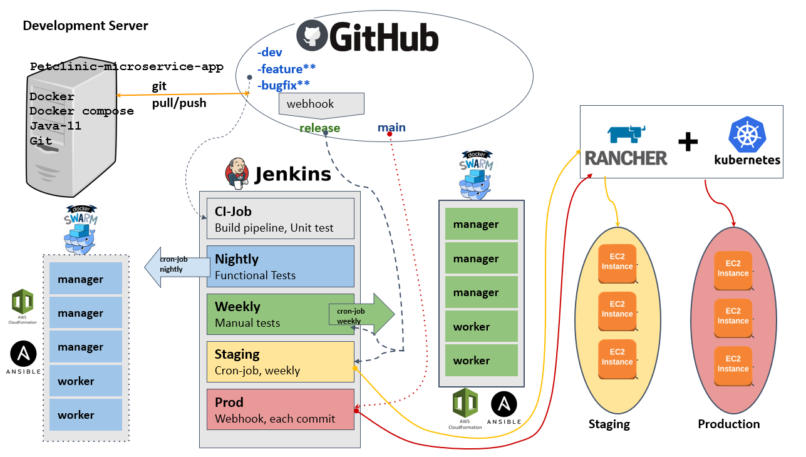
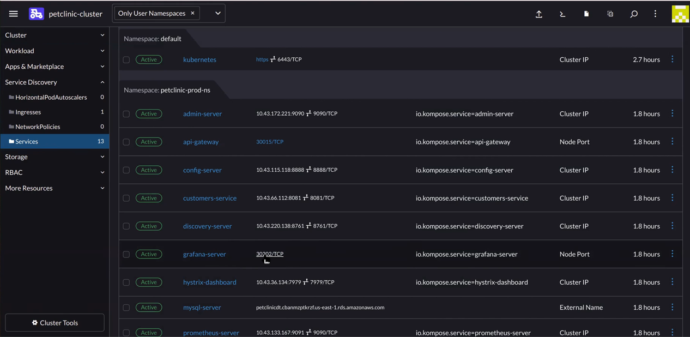
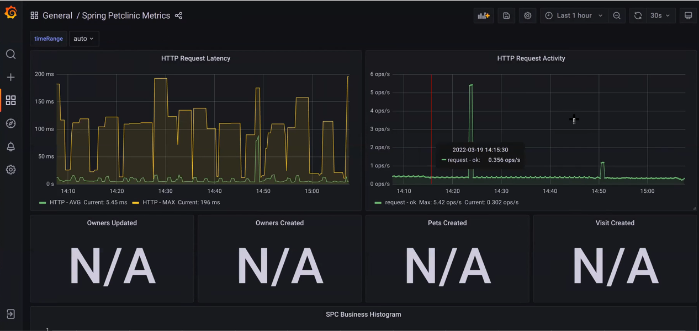

# Full Microservices CI/CD Project 

- I worked mainly on a micro-services application fully automated, a Dockerized Web Application developed in Java Springboot and integrated with MySQL database.

- Jenkins used as the CI/CD Pipelines and deployment on Kubernetes cluster with monitoring. 

- We created all the infrastructure on AWS EC2 Service. Also, we used Git as the version control system during the whole process. 
We prepared base branches namely master, dev, and release for the DevOps cycle.
The code was developed in Java and Maven was used as the build tool. Maven Wrapper used for the testing, packaging, and installing phases. 

- I spun up the development server through a CloudFormation template. We prepared Dockerfiles for each microservices and, we also prepared a Docker Compose file to deploy the application with Docker-Swarm.

- We also used Rancher for creating, controlling, and monitoring Kubernetes clusters for staging and production environments. We used Jenkins pipeline scripts to deploy the application to both staging and production environments. 

