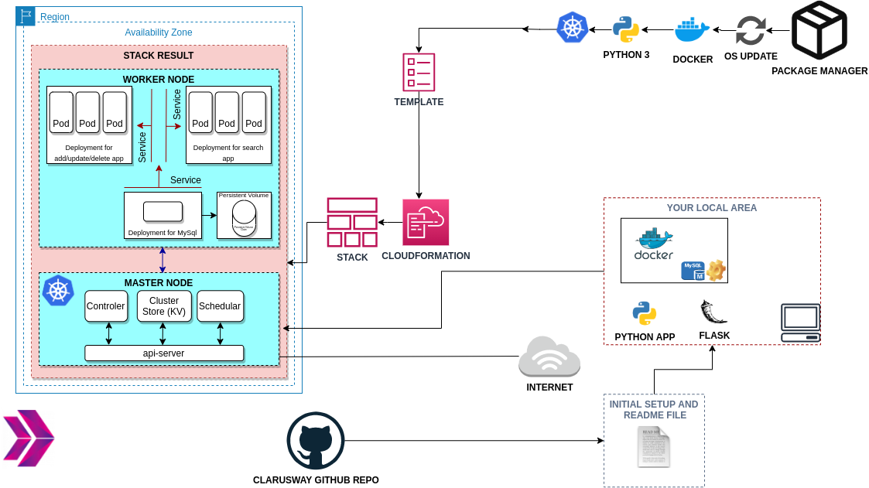
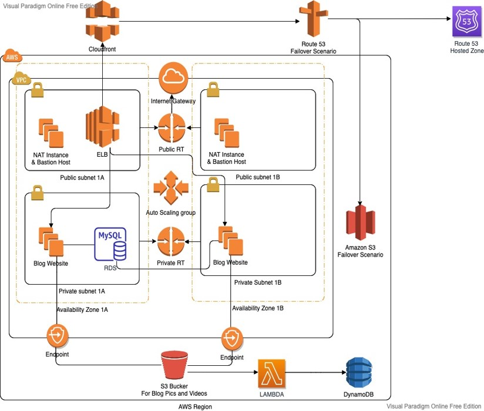
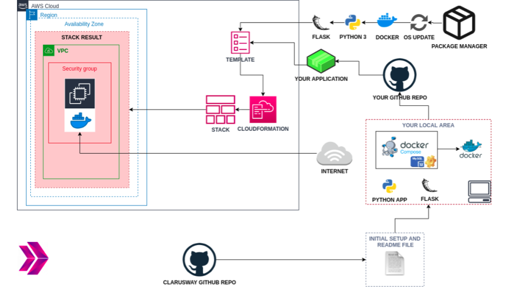
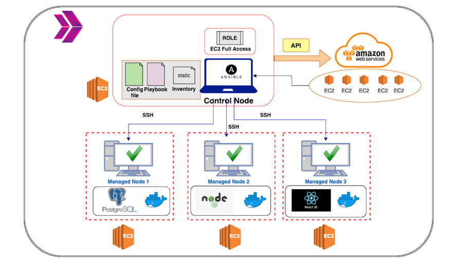
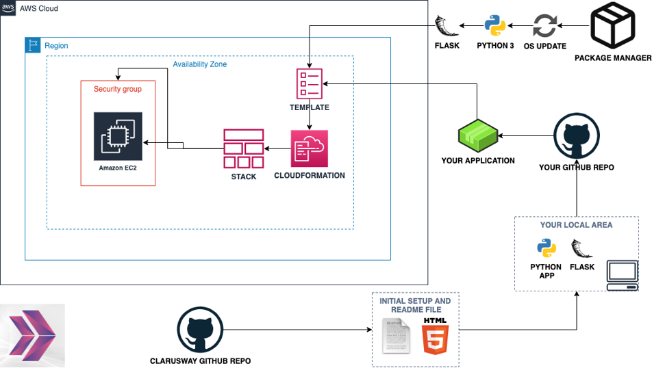

# Phonebook Microservice Web Application:

- We create a web application with MySQL Database using Docker and Kubernetes.

- We have a frontend and a backend service to interact with database service. Each service will be managed by a Kubernetes deployment.

 - The backend service will be a gateway for the application and it will serve the necessary web pages for create, delete and update operations while the frontend service will serve a search page in order to conduct read operations.

- To preserve the data in the database, persistent volume and persistent volume claim concepts adopted. 

# The Blog Page Application:

- We to deploy blog application as a web application written Django Framework on AWS Cloud Infrastructure.

- This infrastructure has ALB with ASG, (EC2) Instances, S3 Bucket and RDS on defined VPC. 

- The Cloudfront and Route 53 services are located in front of the architecture and manage the traffic in secure. User is able to upload pictures and videos on own blog page and these are kept on S3 Bucket. 

# Bookstore Web API Application:

- We create a bookstore web service using Docker for understanding to dockerization of an application.

- The application code is deployed as a RESTful web service with Flask using Dockerfile and Docker Compose on AWS (EC2) Instance using AWS Cloudformation Service.

# The Web-Page Application:

- We to deploy web-page written Nodejs and React Frameworks on AWS Cloud Infrastructure using Ansible.

- Building infrastructure process is managing with control node utilizing Ansible. This infrastructure has 1 control node and 3 EC2’s as worker node. These EC2's will be launched on AWS console.

- Web-page has 3 main components which are postgresql, nodejs, and react. Each component is serving in Docker container on EC2s dedicated for them. Postgresql is serving as Database of web-page. Nodejs controls backend part of web-side and react controls frontend side of web-page. 

# The Roman Numerals Converter Application:

- The project aims to convert the given number to the Roman numerals.

- The application is to be coded in Python and deployed as a web application with Flask on AWS Elastic Compute Cloud (EC2) Instance using AWS Cloudformation and CLI Services.

